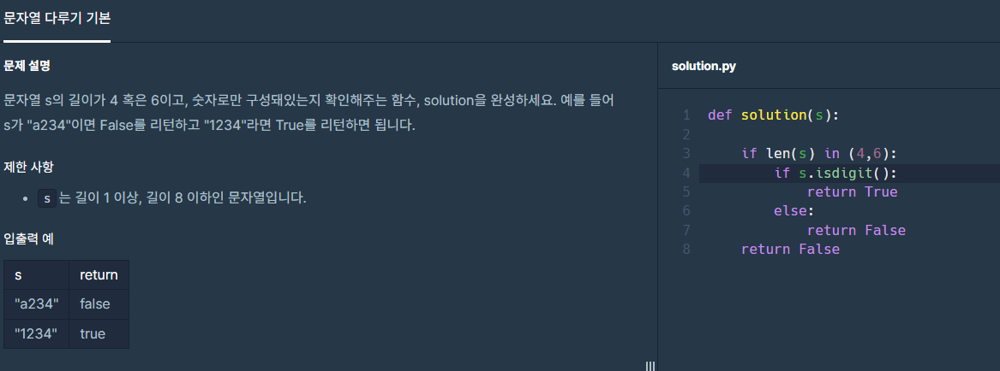
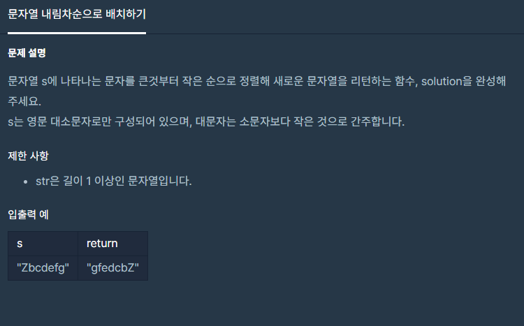
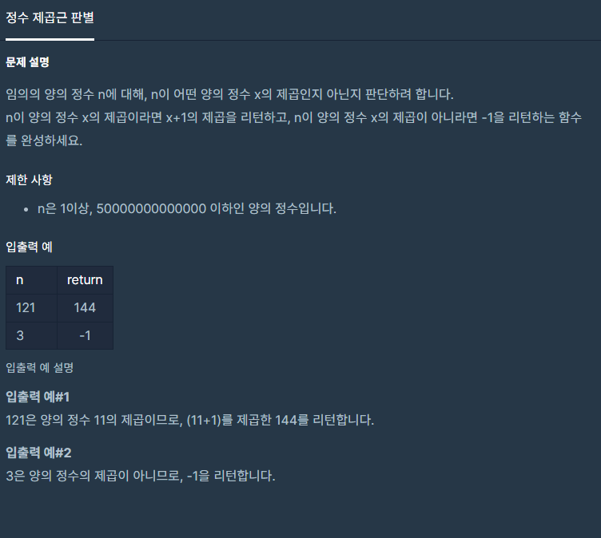
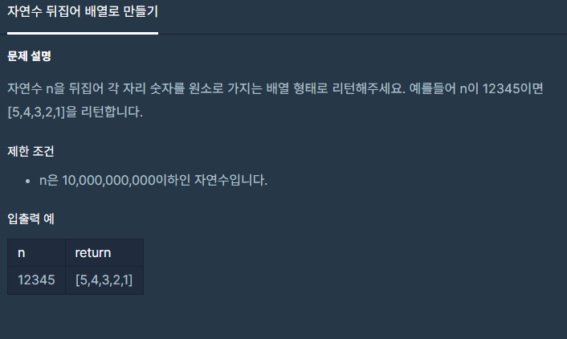

# 알고리즘 문제풀이


## 인프런


### 01. 소수의 갯수


```python
n = int(input())

c = [0] * (n+1)    --- A
cnt = 0

for i in range(2, n+1):
    if c[i] == 0:
        cnt += 1
        for j in range(i, n+1, i):   ---- B
            c[j] = 1
print(cnt)

소수의 갯수를 구하는 방법은 여러가지가 있지만 위와 같은 소스코드를 생각해볼 수 있다.
이 코드에서 중요한 점은 소수와 그 수의 배수를 카운트해주는 방법으로, 빈 배열 --A를 만들어 초기 설정값을 만들어준다.

이후 ---B 처럼 소수를 발견하고, CNT값을 증가시킨 이후엔, 배수의 값을 모두 1로 바꿔서 다음 FOR문이 작동할 시 소수의 값으로 인식하지 못하게 설정한다. range(i, n+1, i)에서 마지막 i는 몇 만큼 건너뛰기를 할 것인지 정하는 용도이다. 
```


## 프로그래머스


## 01. TRUE, FALSE(LEVEL1, 음양 더하기) 


```
<오답 작성 코드>

def solution(absolutes, signs):
    total_sum = 0
    for i in range(len(signs)):
        if signs[i] == 'true':
            total_sum = total_sum + absolutes[i]
        else:
            total_sum = total_sum - absolutes[i]
    return total_sum

----------------------------

<정답 코드>

def solution(absolutes, signs):
    total_sum = 0
    for i in range(len(signs)):
        if signs[i]:
            total_sum = total_sum + absolutes[i]
        else:
            total_sum = total_sum - absolutes[i]
    return total_sum
    
    
TRUE는 1, flase는 0으로 인식한다는 점을 고려해야한다. 즉, 오답으로 작성했을 때의 코드는 배열안에 true를 string으로 접근해서 풀었다. 하지만 잘 생각해보면 컴퓨터는 TRUE는 1, flase는 0이라고 인식하기에 string으로 접근하는 것은 문제 접근의 오류다. if sign[i]: 로 끝나도 되는 이유는 어차피 if 절이 참일 때, 즉 true일 때 다음 코드가 실행되므로 굳이 sign[i] == 1 을 쓸 필요가 없다(써도 정답은 같다).   
```


## 02. 자리수 더하기(Level1, 자릿수 더하기)


```
자연수의 자릿수를 더하는 방법으로 여러가지가 있지만 작성한 코드도 한 가지 방법이다.
문법처럼 외워서 사용해두면 편할 듯하다.
```


## 03. in, isdigit(LEVEL1, 문자열 다루기 기본)



```python
if len(s) in (4,6):   ---- A
    if s.isdigit():    ---- B
        return True
    else:
        return False    
return False   

이 문제에서 공부한 내용은 두 가지이다.

1. in

--A를 보면, if len(s) == 4 or len(s) == 6 이라고도 작성할 수 있지만, in의 개념을 사용해서 깔끔하게 단 몇 글자로 의미가 같게 만들 수 있다.

2. isdigit()
--B를 보면 isdigit()문법이 있다. 처음에 풀 때는 for문으로 해서 문자열을 하나하나 '0123456789'라는 숫자값에 대입해서 숫자가 아닌 알파벳이 있는지 확인했지만 isdigit()문법은 그런 번거로움 없이 한번에 확인할 수 있는 문법이다. 즉 isdigit는 '문자열이 숫자로 구성되었는지'를 확인하는 문법이다. 매우 유용하므로 반드시 기억하자.
```


### 04. JOIN (LEVEL1, 알파벳 순서)



```python
def solution(s):
    
    str_list = list(s)  ---- A
    str_list.sort(reverse=True) ---- B
    ans = ''.join(str_list)  ----- C
    return ans

이 문제를 통해 알게 된 것은 JOIN문법이다.

우선 문자열(STR)은 그 자체로 SORT(정렬) 할 수 없다. 따라서 ---A 코드를 작성해 문자열을 리스트로 바꿔 배열 안에 알파벳을 하나씩 담는다. 

리스트에 담긴 알파벳은 SORT가 가능한 상태인데 

1. SORT()를 할 경우(역순이 아닌), 대문자 -> 소문자 순으로 오름차순으로 정렬된다.
따라서 --B 코드를 작성해서 소문자가 먼저 오도록 역순의 조건을 주었다.

2. 1번 과정을 통해 리스트에는 소문자에서 대문자 순으로 내림차순으로 정렬된 알파벳이 담겨있다. 그런데 출력은 문자열로 해야함으로, ---C 코드를 작성해서 '' 공백을 기준으로 str_list에 담겨있는 값들을 합쳐주는 과정이 필요하다.
```


### 05. INT(LEVEL1, 문자열 정수로 바꾸기)


```python
def solution(s):
    return int(s)


이 문제를 통해 INT에 대한 성질을 알 수 있었다.

1. '+1234', '-23252' 처럼 부호와 숫자가 섞여있는 문자열을 숫자형으로 바꿀 때 INT하나면 PYTHON은 부호를 고려해 숫자형으로 바꿔준다. 매우 편리한 기능이므로, FOR문이나 IF문을 굳이 쓰면서 할 필요가 없다.
```


### 06. INT(LEVEL1, 정수 제곱근 판별)



```python
def solution(n):
    num = n ** 0.5     ----- A
    if int(num) == num:   ----- B
        return (num + 1) ** 2
    else:
        return -1
    
Int의 논리적인 문법을 알 수 있는 문제다.

우선 제곱근을 구하기 위해서 주어진 숫자 n을 -- A로 표현한다.
만약 --A를 통해 n이 제곱근을 가진다면 정수로 딱 떨어진다. 반면에 제곱근을 갖지 못한다면 숫자는 float 형태로 떨어진다. 어떤 형태로 나올지는 모르지만 ---B 조건문을 통해 제곱근이 정수로 혹은 실수로 나타난지를 판별할 수 있다. 즉, 정수로 떨어진 값에 INT값을 씌우면 원래값과 동일한 값이 나온다. 고로 제곱근 값이 정수형인 것을 확인할 수 있다. 반면 제곱근 값이 실수형이라면 INT(NUM)은 소수값이 0.5이상이면 INT값을 씌우면 반올림이 된다. 또한 0.5보다 아래면 버림을 한다. 따라서 버리든, 올리든 원값이 NUM과는 다른 값이 출력되므로 제곱근이 실수형이라는 것을 파악할 수 있다.
```


### 07. Reverse(Level1, 자연수 뒤집기)



```python
temp = str(n)
ans = []
for i in temp:
    ans.append(int(i))
ans.reverse() ---- A
return ans


이 문제는 테스트케이스가 하나뿐이라 자칫 문제를 착각할 수도 있다. 문제에서 요구하는 건 주어진 n을 거꾸로 배열한 ans를 원하는 것이다. sort or sort(reverse=True) 문법을 사용하면 숫자를 오름차순 혹은 내림차순으로 정렬하는 것이다. 숫자의 크기를 통해 정렬하는 것을 요구하는 것이 아니라, 숫자 자체를 그냥 뒤집는 것은 ---- A 처럼 단순하게 접근하면 된다.
```


### 08. Split(Level1, 이상한 문자 만들기)


```python
def solution(s):
    arr = s.split(' ') #['try', 'hello','','','','world']
    ans = ''

    for i in arr: 
        for idx, value in enumerate(i):
            if idx == 0 or idx % 2 == 0:
                ans += value.upper()
            else:
                ans += value.lower()
        ans += ' '        
    real_ans = ans[:-1]
    return real_ans

이 문제는 split()의 개념을 알 수 있는 중요한 문제다. 

우선 split() 와 split(" ")은 차이점이 있다. 
예를 들어 arr = "a                     a a" 라는 변수에 다음과 같은 문자열을 담았다고 가정하다. 이 때 다음과 같은 출력값을 확인할 수 있다.

print(s.split(" "))  ---- A
['a', '', '', 'a', 'a', '', '', '']
print(s.split())   ----- B
['a', 'a', 'a']

---A 를 보면, arr에 있는 알파벳 뿐만 아니라, 공백의 갯수까지 모두 정확하게 리스트에 담았다. 반면 --B를 보면 공백의 갯수가 굉장히 많은데, 모든 공백을 1개로 취급한 모습을 보인다. 

문제에서 한 단어와 단어 사이에는 '한 개 이상의 공백이 포함 될 수 있다' 고 언급했으므로, 공백을 모두 살려줘야 한다. 따라서 SPLIT()이 아닌 SPLIT(" ")으로 적용해야 올바른 문제 해결이 가능하다.
```

