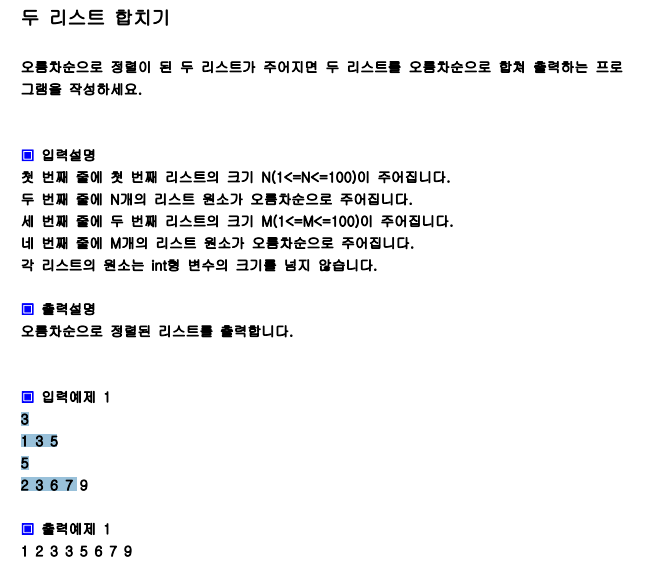
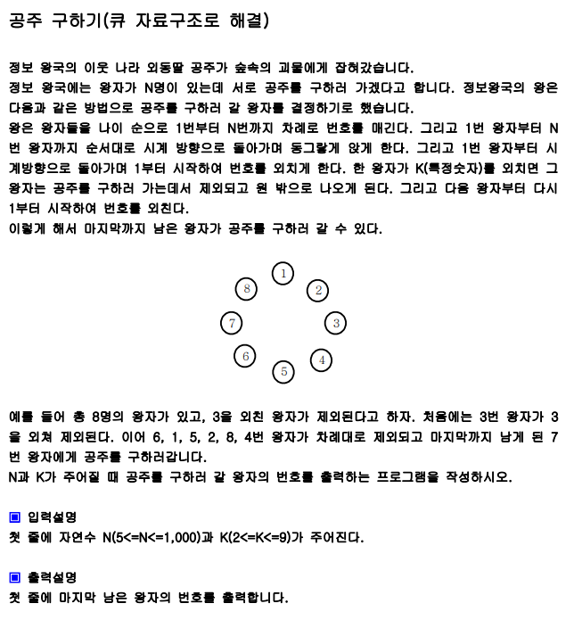
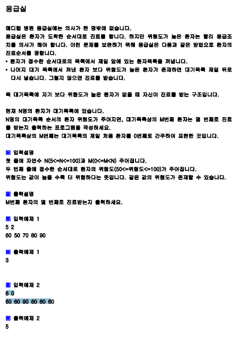
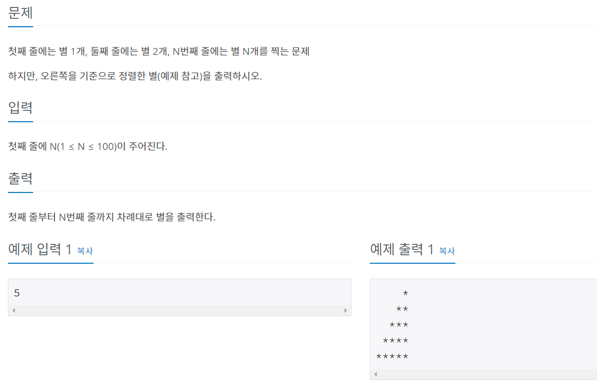
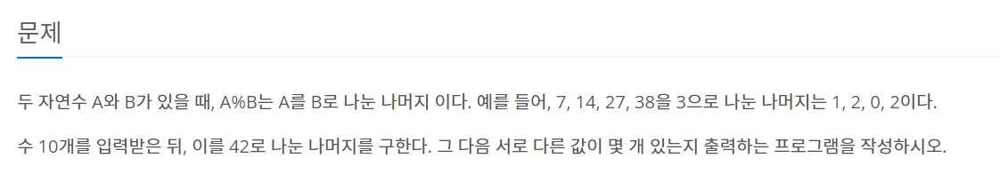
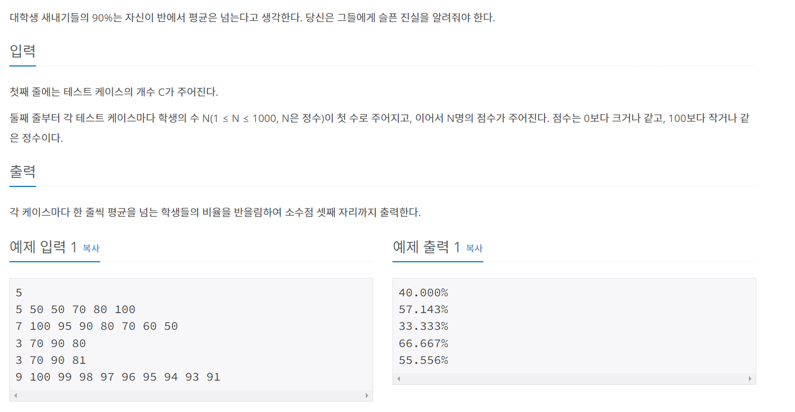
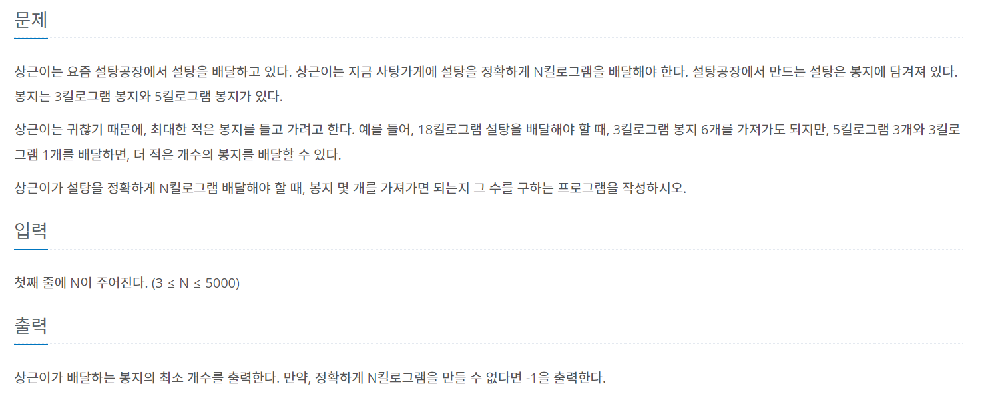

# 알고리즘 문제풀이


## 인프런


### 01. 소수의 갯수


```python
n = int(input())

c = [0] * (n+1)    --- A
cnt = 0

for i in range(2, n+1):
    if c[i] == 0:
        cnt += 1
        for j in range(i, n+1, i):   ---- B
            c[j] = 1
print(cnt)

소수의 갯수를 구하는 방법은 여러가지가 있지만 위와 같은 소스코드를 생각해볼 수 있다.
이 코드에서 중요한 점은 소수와 그 수의 배수를 카운트해주는 방법으로, 빈 배열 --A를 만들어 초기 설정값을 만들어준다.

이후 ---B 처럼 소수를 발견하고, CNT값을 증가시킨 이후엔, 배수의 값을 모두 1로 바꿔서 다음 FOR문이 작동할 시 소수의 값으로 인식하지 못하게 설정한다. range(i, n+1, i)에서 마지막 i는 몇 만큼 건너뛰기를 할 것인지 정하는 용도이다. 
```


### 02. 숫자뒤집기, 소수개수


```python
def reverse(x):     ----- A
    ans = 0
    while x > 0 :
        temp = x % 10
        ans = ans * 10 + temp   ---- B
        x = x // 10
    return ans


def prime_num(x):
    for i in range(2, x//2 + 1):    ---- C
        if x % i == 0:
            return False
    else:
        return True        ------- D

n = int(input())
a = list(map(int,input().split()))
for x in a:
    tem = reverse(x)
    if prime_num(tem):
        print(tem)     
        
숫자를 뒤집고, 소수를 찾는 함수를 작성하는 좋은 문제다.
우선 --- A는 숫자를 뒤집어주는 함수이다. 이때 숫자는 뒤집어도 0으로 시작하지 않게끔 해준다. -- B의 원리를 잘 생각해보면 좋다.

--- C는 소수를 찾는 함수이다. 이때 range() 범위에서 x // 2 + 1를 하는 이유는 굳이 x라고 할 필요가 없다. 코드의 효율성을 위해 범위를 줄여준 것이다. 
```


### 03. 반올림


```python
n = int(input())
arr = list(map(int, input().split()))
avg_score = int((sum(arr) / len(arr)) + 0.5)     ------ A
min_gap = 21470000

for idx, value in enumerate(arr):
    temp = abs(avg_score - value)
    if min_gap > temp:
        min_gap = temp
        score = value
        res = idx + 1
    elif min_gap == temp:
        if value > score:
            score = value
            res = idx + 1
print(avg_score, res)

파이썬에서 반올림을 할 때 주의해야 할 점이 있다. 보통 반올림하면 떠오르는 문법이 ROUND() 이다. 일반적으로 소수 자리가 5이상 일 때는 반올림하여 정수 값을 하나 올린다. 이 방식을 ROUND_HALF_UP(RHU) 방식이라고 하는데, 파이썬은 ROUND함수가 UP방식이 아닌 ROUND_HALF_EVEN 방식을 채택한다. 

예를들어, a = 4.50000일 경우 RHU로 계산하면 a = 5가 된다.
그러나 파이썬에서 round()문법을 사용하면 a = 4가 된다. 그 이유는 4.51111 처럼 0.5보다 조금이라도 크면 RHU처럼 반올림을 해버리지만, 정확히 4.5일 경우에는 정수값이 짝수인 경우로 반올림 혹은 반내림을 해버린다. a의 정수값이 4이므로(짝수), round()함수 사용시 a = 4가 된다. a = 5.5000인 경우 a의 정수값에서 가장 가까운 짝수는 6이므로 round()함수 사용시 a = 6이 된다.

따라서 파이썬에서 반올림을 할 때에는 round함수 보다는 ---- A 처럼 더할 값에 다가 0.5를 미리 더한 뒤 INT()로 묶어주는 방법을 권한다. 
```


### 04. 리스트합치기



```python
sum_arr = []
for _ in range(2):
    n = int(input())
    arr = list(map(int, (input().split())))
    sum_arr += arr

sum_arr.sort()
print(sum_arr)
------------------------

n = int(input())
a = list(map(int, (input().split())))
m = int(input())
b = list(map(int, (input().split())))
a_point = b_point = 0       ------- A
arr = []
while a_point < n and b_point < m:         ---------- B
    if a[a_point] <= b[b_point]:
        arr.append(a[a_point])
        a_point += 1
    else:
        arr.append(b[b_point])
        b_point += 1

if a_point < n:
    arr = arr + a[a_point:]      ------- C
if b_point < n:
    arr = arr + b[b_point:]
    
두 코드 모두 정답이다. 하지만 첫번째 코드와 두번째 코드의 차이점은 시간복잡도에서 차이가 난다. 즉 첫번째 코드는 N log N의 복잡도 가지며, 두번째 코드는 이미 n, m의 배열을 봤을 때 이미 정렬된 상태이므로, 따로 정렬을 다시 할 필요없어 두번째 코드를 통하여 정렬하면 N의 복잡도를 가진다. 즉 첫번째 코드보다 더 효율적인 메모리와 시간을 사용한다. 
```


### 05. ALL()


```python
import sys
sys.stdin = open("input.txt", "rt")

n = int(input())
arr = [list(map(int, (input()).split())) for _ in range(n)]

arr.insert(0, [0]*n)
arr.append([0]*n)

for i in arr:
    i.insert(0, 0)
    i.append(0)

dx = [-1, 0, 1, -0]  # 위 ,오른,아래,왼쪽 순서
dy = [0, 1, 0, -1]

c = 0
for i in range(1, n+1):
    for j in range(1, n+1):
        cnt = 0
        for m in range(4):
            if arr[i][j] > arr[i+dx[m]][j+dy[m]]: --- A
                cnt += 1
        if cnt == 4:
            c += 1
print(c)

-----------------------------------------------
cnt = 0
for i in range(1, n+1):
    for j in range(1, n+1):
          if all(arr[i][j] > arr[i+dx[m]][j+dy[m]] for k in range(4): --- B
                cnt += 1
print(cnt)


ALL 문법은 AND와 같은 개념이다. 즉, 모든 조건이 충족되어야만 IF문이 참이된다. 단 하나라도 조건에 충족되지 않으면 FALSE값이 도출된다. (단 하나라도 충족할 경우를 생각하면 ANY()문법을 사용하면 된다.) ----A 코드는 기준점의 상하좌우 값이 기준점보다 모두 작을 때 CNT를 하나씩 증가시키고, CNT값이 4가 되면(조건을 모두 충족) 그 기준점은 조건을 충족했다는 의미를 가진다. 

---B 역시 같은 의미이다. 그러나 ---A 코드보다 보다 효율적으로 코드를 작성하고, 오히려 직관적일 수 있다. ALL,ANY 문법 사용을 시도해보자.
```


### 06. Stack


```python
import sys
sys.stdin = open("input.txt", "rt")

num, n = map(int, (input().split()))
num = list(map(int, str(num))) ------------- A
stack = []
for i in num:
    while stack and n > 0 and stack[-1] < i:     --------- B
        stack.pop()
        n -= 1
    stack.append(i)

if n != 0:
    stack = stack[:-2]

for i in stack:
    print(i, end='')
---------------------------
stack 문법을 확인하는 문제다. 

---A 문법을 익히자. for문과 append를 사용해서 새로운 num 배열을 만들지 말고, ---A 코드처럼 한 줄로 간결하게 표현할 수 있다. 

stack 문법의 핵심적 코드로 --- B를 살펴볼 수 있다. 빈 Stack이 아니고(while stack), Stack 리스트에 들어가 있는 가장 마지막(stack[-1])을 표현하는 코드다. and로 연결된 조건이기에 단 하나라도 충족하지 않으면 while문 아래의 코드는 작동되지 않는다. 
```


## 07. clear()


```python

import sys
sys.stdin = open("input.txt", "r")
# 입출력받기

n = int(input())
arr = list(map(int, input().split()))
print(arr)

# 초기값 세팅하기
lt = 0
rt = n-1
largest = 0  # 처음에 시작할 비교값 및 이후에 계속 변할 기준값
ans = ''  # 정답문자열담을 비어있는 값
temp = []  # 임시로 밤아둘 것


while lt <= rt:
    if arr[lt] > largest:
        temp.append((arr[lt], 'L'))
    if arr[rt] > largest:
        temp.append((arr[rt], 'R'))
    temp.sort()
    if len(temp) == 0:
        break
    else:
        ans += temp[0][1]
        largest = temp[0][0]
        if temp[0][1] == 'L':
            lt += 1
        else:
            rt -= 1
    temp.clear()   --------- A

print(len(ans))
print(ans)

메서드 .Clear()는 배열에 담겨 있는 모든 값들을 없애는 기능을 구현한다. 
```


## 08. 후위식표현,stack


```python
import sys
sys.stdin = open("input.txt", "r")

#입력값, 초기설정값
s = input()
ans = ''
stack = []

for i in s:
    if i.isdecimal():
        ans += i  # 피연산자 경우 바로 이어붙이기

    else:  # i가 숫자가 아닌 연산자인 경우
        if i == '(':
            stack.append(i)
        elif i == '*' or i == '/':
            while stack and (stack[-1] == '*' or stack[-1] == '/'):
                ans += stack.pop()
            stack.append(i)
        elif i == '+' or i == '-':
            while stack and stack[-1] != '(':
                ans += stack.pop()
            stack.append(i)
        else:  # ')'
            while stack and stack[-1] != '(':
                ans += stack.pop()
            stack.pop()
while stack:
    ans += stack.pop()
print(ans)

중위식 표현이 아닌 후위식 표현. 이해하지 못했다면 외우면서 이해하자.
```


## 09. 큐(deque)



```python
import sys
from collections import deque  ------ A
sys.stdin = open("input.txt", "r")

#입력값, 초기설정값
n, t = map(int, input().split())
dequ = [i for i in range(1, n+1)] 
dequ = deque(dequ) -------- B
idx = 1

while len(dequ) != 1:
    if idx == t:
        dequ.popleft() ------- C
        idx = 1
    else:
        dequ.append(dequ.popleft()) 
        idx += 1
print(dequ[0])


큐(deque)는 선입선출의 개념이다. 즉 스택(stack)은 후입선출의 개념이었지만, 큐는 먼저 들어온 것이 먼저 나가는 구조를 가지고 있다. deque를 쓰기 위해선 --- A 라이브러리에서 IMPORT를 해오고, 정렬하고자 하는 것을 ----B코드처럼 deque로 감싸줘야 한다.  popleft()는 정렬의 순서상 가장 첫번째인 ex)dequ[0]것을 pop하는 개념이다.
```


## 10. any()



```py
import sys
from collections import deque
sys.stdin = open("input.txt", "r")

#입력값, 초기설정값
n, m = map(int, input().split())
deq = [(order, danger)
       for order, danger in enumerate(list(map(int, input().split())))]
deq = deque(deq)
cnt = 0

while True:
    c = deq.popleft()
    if any(c[1] < i[1] for i in deq): ----------- A
        deq.append(c)
    else:
        cnt += 1
        if c[0] == m:
            break
print(cnt)

any() 문법을 숙지하는 것이 중요하다. any()값은 많은 경우의 수 중 하나라도 조건을 만족하면 True값을 반환하며 아래 코드를 실행한다. 
```


## 11. dictionary.get


```py
import sys
# from collections import deque
sys.stdin = open("input.txt", "r")

#입력값, 초기설정값
word1 = input()
word2 = input()
dict1 = {}
dict2 = {}
for i in word1:
    dict1[i] = dict1.get(i, 0) + 1 --------- A

for i in word2:
    dict2[i] = dict2.get(i, 0) + 1

for i in dict1.keys():
    if i in dict2.keys():
        if dict1[i] != dict2[i]:
            print('no')
            break
    else:
        print('no')
        break
else:
    print('yes')

    
딕셔너리는 일반 변수에서 누적합을 구하는 식과 조금 다른 방법을 취해야 한다. 일반 변수는 변수의 값을 0으로 설정한 뒤 += 1을 통해 누적합을 구할 수 있다. 하지만 딕셔너리는 빈 배열에 초기값을 설정할 수 없다. 이 때 -----A 코드를 사용하면 된다. 즉 키에 할당할 값은 딕셔너리.get('찾고자하는 문자열or숫자',0) + 1 이다. 이 코드를 해석해보면, 찾고자하는 문자가 없다면 뒤에 있는 0이 반환된고, 만약 있다면 1(+1을 첨가했기 떄문에)을 준다. 
```


## 프로그래머스


## 01. TRUE, FALSE(LEVEL1, 음양 더하기) 


```python
<오답 작성 코드>

def solution(absolutes, signs):
    total_sum = 0
    for i in range(len(signs)):
        if signs[i] == 'true':
            total_sum = total_sum + absolutes[i]
        else:
            total_sum = total_sum - absolutes[i]
    return total_sum

----------------------------

<정답 코드>

def solution(absolutes, signs):
    total_sum = 0
    for i in range(len(signs)):
        if signs[i]:
            total_sum = total_sum + absolutes[i]
        else:
            total_sum = total_sum - absolutes[i]
    return total_sum
    
    
TRUE는 1, flase는 0으로 인식한다는 점을 고려해야한다. 즉, 오답으로 작성했을 때의 코드는 배열안에 true를 string으로 접근해서 풀었다. 하지만 잘 생각해보면 컴퓨터는 TRUE는 1, flase는 0이라고 인식하기에 string으로 접근하는 것은 문제 접근의 오류다. if sign[i]: 로 끝나도 되는 이유는 어차피 if 절이 참일 때, 즉 true일 때 다음 코드가 실행되므로 굳이 sign[i] == 1 을 쓸 필요가 없다(써도 정답은 같다).   
```


## 02. 자리수 더하기(Level1, 자릿수 더하기)


```
자연수의 자릿수를 더하는 방법으로 여러가지가 있지만 작성한 코드도 한 가지 방법이다.
문법처럼 외워서 사용해두면 편할 듯하다.
```


## 03. in, isdigit(LEVEL1, 문자열 다루기 기본)


```python
if len(s) in (4,6):   ---- A
    if s.isdigit():    ---- B
        return True
    else:
        return False    
return False   

이 문제에서 공부한 내용은 두 가지이다.

1. in

--A를 보면, if len(s) == 4 or len(s) == 6 이라고도 작성할 수 있지만, in의 개념을 사용해서 깔끔하게 단 몇 글자로 의미가 같게 만들 수 있다.

2. isdigit()
--B를 보면 isdigit()문법이 있다. 처음에 풀 때는 for문으로 해서 문자열을 하나하나 '0123456789'라는 숫자값에 대입해서 숫자가 아닌 알파벳이 있는지 확인했지만 isdigit()문법은 그런 번거로움 없이 한번에 확인할 수 있는 문법이다. 즉 isdigit는 0,1,2,3,4 등 일반적인 숫자뿐만 아니라 3**2 처럼 제곱수 등의 숫자까지 인식한다.'문자열이 숫자로 구성되었는지'를 확인하는 문법이다. 매우 유용하므로 반드시 기억하자.

3. isdecimal() 
- isdigit()와 비슷하지만 딱 0,1,2,3,4,5,6,7,8,9으로 이루어진 숫자만 인식할 수 있다. 3**2 같은 지수는 숫자로 인식하지 않는다.
```


### 04. JOIN (LEVEL1, 알파벳 순서)


```python
def solution(s):
    
    str_list = list(s)  ---- A
    str_list.sort(reverse=True) ---- B
    ans = ''.join(str_list)  ----- C
    return ans

이 문제를 통해 알게 된 것은 JOIN문법이다.

우선 문자열(STR)은 그 자체로 SORT(정렬) 할 수 없다. 따라서 ---A 코드를 작성해 문자열을 리스트로 바꿔 배열 안에 알파벳을 하나씩 담는다. 

리스트에 담긴 알파벳은 SORT가 가능한 상태인데 

1. SORT()를 할 경우(역순이 아닌), 대문자 -> 소문자 순으로 오름차순으로 정렬된다.
따라서 --B 코드를 작성해서 소문자가 먼저 오도록 역순의 조건을 주었다.

2. 1번 과정을 통해 리스트에는 소문자에서 대문자 순으로 내림차순으로 정렬된 알파벳이 담겨있다. 그런데 출력은 문자열로 해야함으로, ---C 코드를 작성해서 '' 공백을 기준으로 str_list에 담겨있는 값들을 합쳐주는 과정이 필요하다.
```


### 05. INT(LEVEL1, 문자열 정수로 바꾸기)


```python
def solution(s):
    return int(s)


이 문제를 통해 INT에 대한 성질을 알 수 있었다.

1. '+1234', '-23252' 처럼 부호와 숫자가 섞여있는 문자열을 숫자형으로 바꿀 때 INT하나면 PYTHON은 부호를 고려해 숫자형으로 바꿔준다. 매우 편리한 기능이므로, FOR문이나 IF문을 굳이 쓰면서 할 필요가 없다.
```


### 06. INT(LEVEL1, 정수 제곱근 판별)


```python
def solution(n):
    num = n ** 0.5     ----- A
    if int(num) == num:   ----- B
        return (num + 1) ** 2
    else:
        return -1
    
Int의 논리적인 문법을 알 수 있는 문제다.

우선 제곱근을 구하기 위해서 주어진 숫자 n을 -- A로 표현한다.
만약 --A를 통해 n이 제곱근을 가진다면 정수로 딱 떨어진다. 반면에 제곱근을 갖지 못한다면 숫자는 float 형태로 떨어진다. 어떤 형태로 나올지는 모르지만 ---B 조건문을 통해 제곱근이 정수로 혹은 실수로 나타난지를 판별할 수 있다. 즉, 정수로 떨어진 값에 INT값을 씌우면 원래값과 동일한 값이 나온다. 고로 제곱근 값이 정수형인 것을 확인할 수 있다. 반면 제곱근 값이 실수형이라면 INT(NUM)은 소수값이 0.5이상이면 INT값을 씌우면 반올림이 된다. 또한 0.5보다 아래면 버림을 한다. 따라서 버리든, 올리든 원값이 NUM과는 다른 값이 출력되므로 제곱근이 실수형이라는 것을 파악할 수 있다.
```


### 07. Reverse(Level1, 자연수 뒤집기)


```python
temp = str(n)
ans = []
for i in temp:
    ans.append(int(i))
ans.reverse() ---- A
return ans


이 문제는 테스트케이스가 하나뿐이라 자칫 문제를 착각할 수도 있다. 문제에서 요구하는 건 주어진 n을 거꾸로 배열한 ans를 원하는 것이다. sort or sort(reverse=True) 문법을 사용하면 숫자를 오름차순 혹은 내림차순으로 정렬하는 것이다. 숫자의 크기를 통해 정렬하는 것을 요구하는 것이 아니라, 숫자 자체를 그냥 뒤집는 것은 ---- A 처럼 단순하게 접근하면 된다.
```


### 08. Split(Level1, 이상한 문자 만들기)


```python
def solution(s):
    arr = s.split(' ') #['try', 'hello','','','','world']
    ans = ''

    for i in arr: 
        for idx, value in enumerate(i):
            if idx == 0 or idx % 2 == 0:
                ans += value.upper()
            else:
                ans += value.lower()
        ans += ' '        
    real_ans = ans[:-1]
    return real_ans

이 문제는 split()의 개념을 알 수 있는 중요한 문제다. 

우선 split() 와 split(" ")은 차이점이 있다. 
예를 들어 arr = "a                     a a" 라는 변수에 다음과 같은 문자열을 담았다고 가정하다. 이 때 다음과 같은 출력값을 확인할 수 있다.

print(s.split(" "))  ---- A
['a', '', '', 'a', 'a', '', '', '']
print(s.split())   ----- B
['a', 'a', 'a']

---A 를 보면, arr에 있는 알파벳 뿐만 아니라, 공백의 갯수까지 모두 정확하게 리스트에 담았다. 반면 --B를 보면 공백의 갯수가 굉장히 많은데, 모든 공백을 1개로 취급한 모습을 보인다. 

문제에서 한 단어와 단어 사이에는 '한 개 이상의 공백이 포함 될 수 있다' 고 언급했으므로, 공백을 모두 살려줘야 한다. 따라서 SPLIT()이 아닌 SPLIT(" ")으로 적용해야 올바른 문제 해결이 가능하다.
```


### 09. 문자열,JOIN,capitalize()(Level2, 문자열)


```python
def solution(s):
    arr = list(s.split(" ")) ----- A

    for i in range(len(arr)):
        arr[i] = arr[i][0:1].upper() + arr[i][1:].lower() ------ B
    
    return ' '.join(arr)   ---- C

---- B를 통해 문자열의 기본 속성을 반드시 파악해야 한다.
예를들어 a = 'sqsd'라는 변수가 있다고 가정하자. 이때 a = 'keds'라고 코드를 작성한 후 print(a)를 찍어보면 sqsd -> keds로 변한 것을 확인할 수 있다. 그런데, a[0] = 'd'라고 하나만 바꾸고자 한다면 에러가 뜬다. 즉, 문자열은 한 문자 한 문자를 바꿀 수는 없고, 문자열 그 자체를 통째로 다른 문자열로 바꾸는 것만 가능하다. 따라서 ---B 코드와 같이 모든 문자열을 바꿔줘야 한다.

Join은 리스트에 담겨있는 문자열 요소(덩어리)들을 '(붙이고자 하는 기호)'.join(arr)로 문자열들을 설정한 기호를 기준으로 붙여준다. 
--------------------------------------
def solution(s):
    arr = list(s.split(" ")) 

    for i in range(len(arr)):
        arr[i] = arr[i].capitalize() ------ B
    
    return ' '.join(arr)   

capitalize()문법은 문자열의 가장 앞에 있는 문자만 대문자로 바꾸고, 나머지는 문자는 소문자로 바꾸는 메서드다. 
```


## 백준

### 01. 임시변수(Bronze,더하기 사이클)


```python
n = int(input())
num = n  --------- A
cnt = 0

while True:
    a = num // 10  # 십의자리
    b = num % 10  # 일의 자리
    c = (a + b) % 10  # 일의 자리 (새로운 수의)
    num = (b * 10) + c

    cnt += 1
    if n == num:
        break
print(cnt)

이 문제에서 놓쳤던 부분은 --- A인 임시변수 설정이다. 문제를 보면, 새로운 숫자를 기준으로 문제에서 요구하는 일련의 과정을 계속해서 반복하여 처음 원래값이었던 n과 몇 번째만에 같아지는지 묻는다. 따라서 계속해서 바뀌어야 할 값이 원본인 n이 아니라, n을 시작으로 숫자가 바뀌는 임시변수가 필요하다.
```


### 02.Rjust(Bronze,별찍기)



```python
n = int(input())

for i in range(1, n+1):
    star = '*' * i
    print(star.rjust(n))

rjust()문법을 알 수 있는 문제다. rjust,ljust,center 문법은 문자열 정렬에 활용할 수 있는 문법이다. rjust(a)의 경우 a(전체 크기)를 기준으로 정렬하고 싶은 문자열을 오른쪽에서부터 정렬한다는 의미이다. ljust,center 모두 전체 크기를 기준으로 왼쪽, 중앙으로부터 정렬한다는 의미이다. 
```


### 03. Set(Bronze,나머지)



```python
arr = [0] * 42
for _ in range(10):
    n = int(input())
    divc = n % 42
    arr[divc] += 1

cnt = 0
for i in range(42):
    if arr[i] >= 1:
        cnt += 1
print(cnt)

이 문제는 사실 간단하게 풀 수 있는 문제다. 위와 같은 코드가 정답을 구하기 위해 틀린 코드라고는 할 수 없지만 간단하게 풀 수 있는 문제를 너무 복잡한 과정으로 접근했다. '중복' 이라는 문제가 나타나면 항상 set을 떠올리는 연습을 하자. set으로 접근하면 위와 같은 긴 코드가 아래와 같이 짧은 코드로 바뀔 수 있다.

ans = set()
for _ in range(10):
    n = int(input())
    ans.add(n % 42)
print(len(ans))
```


### 04. {:f}(Bronze,평균)

 

```python
t = int(input())
for _ in range(1, t+1):
    arr = list(map(int, input().split()))
    a = arr[0] 
    avg_score = sum(arr[1:]) / a
    under_avg_score_count = 0
    for i in range(1, a+1):
        if arr[i] > avg_score:
            under_avg_score_count += 1
    print("{:.3f}%".format(under_avg_score_count / a * 100, 3)) --- A
    
이 문제에서 중요한 점은 출력의 형태이다. 예제 출력1 처럼 소수점 자리수를 세자리까지 반드시 명시해줘한다. 소수점 자리 출력을 위한 문법으로 --A 코드처럼 '{:(소수점 자리수)f}' 코드를 입력하면 원하는 소수점 자리까지 출력할 수 있다.
```


### 05. 수학적 사고력(Sliver, 달팽이는 올라가고 싶다)


```python
<오답 코드>
A,B,V = map(int, input().split())

day_count = 0
now_height = 0

while True:
	day_count += 1
    now_height += A
    if now_height == V:
        print(day_count)
    else:
        now_height -= B
----------------------------------------
<정답 코드>
A,B,V = map(int, input().split())

if (V-B) % (A-B) == 0 :  --------- A
    print((V-B) // (A-B))
else :
    print(((V-B) // (A-B)) +1)  -------- B
    
우선 오답 코드는 코드 자체의 논리로 틀린 코드는 아니다. 하지만 문제에서 요구하는 시간 안에 계산이 이뤄지지 않았단 점에서 요구조건을 충족하지 못한 코드다.

<정답 코드> 에서 --- A를 도출할 수 있는 사고력이 가장 중요하다. (A-B) 는 하루동안 오르고,내려간 길이이며 (V-B)는 전체 높이에서 내려간 길이를 빼준 값이다. 왜 그래야 하면, 아침에 올라가고, 정상에 도착했을 때는 굳이 내려갈 필요가 없다. 정상에 한 번이라도 도착한 순간 끝이난다. 따라서 정상에 도착했을 때 다시 내려간 길이만큼을 미리 빼준 높이를 상대로 올라가는 식의 코드를 작성해야만 한다.

--- B의 경우는 나눈 몫의 값이 정수로 떨어지지 않는 경우도 있다. 예를 들어 4.2일 이면 우리는 통상 5일이 필요하다고 고려하기 때문에 정수값을 맟추기 위해 + 1 를 더한 것이다.
```


### 06. 수학적 사고력(Sliver, 설탕배달)



```python
n = int(input())
m = 0

while n >= 0:
    if n % 5 == 0:  ------ A
        m += n // 5
        print(m)
        break

    n -= 3           ------ B
    m += 1
else:
    print(-1)   

수학적 사고력을 키울 수 있는 문제다. 5KG 짜리 설탕 봉지를 최대한 많이 사용하고, 5KG 봉지를 사용할 수 없을 때, 3KG를 사용할 수 있으면 봉지 갯수를 더하는 방식이다. 우선 --- A처럼 주어진 KG를 5KG로만으로 포장할 수 있다면 break 문을 걸어줘서 끝내버린다.

만약 5KG만으로 불가능하다면, 3KG을 사용해야 하는데, 전체 N KG에서 3KG을 자꾸 빼주면서 5KG만으로 나눌 수 있을 때 까지 계속해서 빼준다. 만약 3KG을 계속 빼면서 5KG으로 나눌 수 없다면 5,3KG만으로는 나눌 수 없는 무게이니 -1이 출력된다.
```


### 07. int(i**0.5) +1 (Sliver,소수구하기)


```python
<오답 코드>
m, n = map(int, (input().split()))

for i in range(m, n+1):
    if i == 1:
        pass
    else:
        for j in range(2, i//2 + 1):
            if i % j == 0:
                break
        else:
            print(i)
-----------------------
<수정 코드>

m, n = map(int, (input().split()))

for i in range(m, n+1):
    if i == 1: 
        pass
    for j in range(2, int(i** 0.5)+1 ): ----------- A
        if i%j==0:
            break
    else:
        print(i)

소수는 자신과 1밖에 약수가 없는 수이다. 그럼 모든 수를 돌면서 나누어 떨어지는 수가 있는지 없는지 보면 되지만 꼭 모든 수를 볼 필요는 없다. '해당 수의 제곱근'까지만 나눠보면 된다.

약수는 대칭으로 이루어져있기 때문에 (예) 12의 약수는 1 2 3 4 6 12 / 1*12 , 2*6, 3*4 로 대칭
25의 약수는 1 5 25 / 1*25 , 5*5 로 대칭

제곱근 보다 같거나 작은 수까지만 나눠보고 나누어 떨어지는게 있냐 없냐 확인하면 된다. --A도 이런 이유때문에 효율적으로 작성한 코드다. 2같은 경우는 소수이다. --- A를 통해 살펴보면, i가 2이일 때, ---A 는 range(2,2)로 값이 아예 나오지 않는다. 따라서 다음 줄에 있는 if i % j 의 조건을 만족하지 못하므로, else 문법을 타게 된다.
```


### 08. sys(Bronze, 수 정렬하기)


```python
import sys

n = int(input())
num = []
for _ in range(n):
    num.append(int(sys.stdin.readline())) ---------- A

num.sort()

for i in num:
    print(i)
    
    
이 문제에서 알야야 하는 점은 시간 효율성과 관련해 코드를 어떻게 작성하는지에 있다.
보통 입력값을 받을 때, int(input())  or input() 등으로 받는다. 반복문이 없고, 숫자가 크지 않는 등의 상황에선 상관이 없지만, 위와 같이 N의 크기가 100만이 넘어가는 경우는 시간의 효율성을 고려해야 한다.

보통이라면 --A에  num = int(input()) 으로 시작하는 코드를 작성해야 하겠지만, 코드의 효율성을 위해 -- A와 같은 코드를 작성이 필요하다.    

input() == sys.stdin.readline() 이라고 생각하면 편하다.
```


### 09. lambda,sorted(Silver,좌표 정렬하기)


```python
n = int(input())
arr = []
for _ in range(n):
    x, y = map(int, (input().split()))
    # print(x, y)
    arr.append([x, y])

arr.sort(key=lambda x: (x[0], x[1])) ---------- A 

for i in arr:
    print(i[0], i[1])
------------------------

sort(), sorted()의 차이점은 다음과 같다.

sort(): 원본의 정렬 순서도 바꾼다.
sorted(): 원본의 정렬 순서는 바꾸지 않는다(원본 데이터는 변경이 없다)
    
lambda 함수의 조건식은 
 '함수이름 =lambda x(매개변수): x에 관한 함수(적용할 함수식)'이다. 람다 함수 기본 사용 문법과 적용을 익히자   

    
+) ---A에서 arr.sort(key=lambda x: ( - x[0], x[1]))를 가정해보면, '-'를 붙이면 내림차순의 효과를 줄 수 있다. 유용한 개념이니 참고하자
```


### 10. 시간복잡도(Silver, 좌표 압축)


```python
n = int(input())
res = list(map(int, (input().split())))
res2 = sorted(set(res)) 
dict = {res2[i]: i for i in range(len(res2))} ------- A

for i in res:
    print(dict[i], end=' ')
------------------------------

알고리즘 문제풀이시 시간복잡도를 생각해야 하는 문제다.

문제는 간단하다. 이중 FOR문으로 돌려도 정답은 도출할 수 있지만, 시간복잡도에서 초과가 난다. 이중 FOR문의 경우 N^2 복잡도를 가진다. 따라서 dict라는 딕셔너리를 새로 만들고, for문을 통해 n만큼의 시간복잡도의 코드를 사용하여 정답을 도출한다.
```

